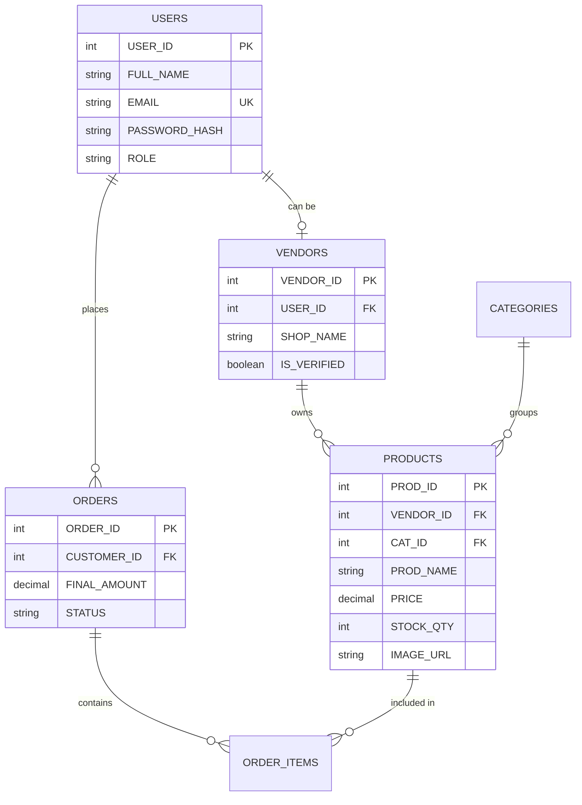

# ShopSphere — Project Technical Report & Architecture

ShopSphere is a high-fidelity, full-stack e-commerce ecosystem designed to provide a premium shopping experience while offering robust management tools for vendors and administrators. Built on a modern glassmorphic design system, it bridges the gap between legacy reliability and modern aesthetics.

---

## 1. Project Overview
ShopSphere is a multi-role commerce platform that handles everything from AI-driven product discovery to secure transactional checkout flows.

- **Primary Goal**: Deliver a seamless, premium storefront with high-resolution visuals and interactive states.
- **User Roles**: 
  - **Customers**: Product browsing, wishlist management, and secure checkout.
  - **Vendors**: Product lifecycle management and shop profile control.
  - **Admins**: Platform oversight, vendor verification, and system health monitoring.

---

## 2. Technical Stack & Architecture

ShopSphere follows a **Monolithic Client-Server Architecture** with a decoupled data layer.

### Frontend (Presentation Layer)
- **Framework**: AngularJS v1.8.x (Single Page Application).
- **Styling**: Vanilla CSS3 with Modern Variables (CSS Custom Properties).
- **Animations**: `ngAnimate` + CSS Keyframes for high-performance transitions.
- **Routing**: `ngRoute` for client-side navigation.
- **Key Services**:
  - `StateService`: Reactive global state management and toast notifications.
  - `AuthService`: Persistent session management via JWT.
  - `CartService`: LocalStorage-backed cart persistence with real-time sync.

### Backend (Logic Layer)
- **Runtime**: Node.js.
- **Framework**: Express.js (v5.x).
- **Authentication**: JWT (JSON Web Tokens) stored in HTTP-only secure cookies.
- **Utilities**: `bcrypt` for password hashing, `nodemailer` for communications.
- **Middleware**: Custom Role-Based Access Control (RBAC).

### Database (Data Layer)
- **Engine**: SQLite (Local Dev) / MySQL (Production Ready).
- **Schema Management**: Relational modeling with transactional integrity (specifically for Order flows).

---

## 3. Database Modeling (ERD)

The database consists of 6 core tables designed for high relational efficiency:

---

## 4. Key Innovative Features

### 🖼️ AI-Driven Image Sourcing
ShopSphere uses a custom `imageService` integrated with **Pollinations AI** to ensure every product always has a high-quality, relevant visual.
- **Deterministic Seeding**: Products use their IDs as seeds to ensure consistent image rendering.
- **Smart Fallbacks**: A two-tier recovery system (AI Sourcing -> Local Placeholder) ensures zero broken images.

### 🌓 Glassmorphic UI & Dynamic Theming
A premium design language using:
- **Backdrop Blurs**: Heavy use of `backdrop-filter: blur(20px)` for a sophisticated, layered look.
- **Theme Engine**: A persistent CSS-variable-based Light/Dark mode toggle with zero-flash persistence.

### 🛒 Transactional Order Processing
The order flow uses **Database Transactions** to ensure data consistency:
1. Validates stock availability.
2. Deducts stock quantities upon order placement.
3. Automatically replenishes stock if an order is cancelled.

---

## 5. Security & Deployment

- **JWT Auth**: Sessions are protected by signed JWTs in secure cookies, preventing CSRF and XSS-based session hijacking.
- **Stateless API**: The backend is designed to be stateless, allowing for horizontal scaling behind a Load Balancer.
- **Pre-rendering**: Critical UI paths are pre-optimized to prevent CLS (Cumulative Layout Shift) using aspect-ratio containers.

---

## 6. Future Roadmap
- **Microservices Migration**: Decoupling the Order service for high-volume periods.
- **PWA Support**: Enabling offline browsing and push notifications for order updates.
- **AI Personalization**: Implementing a recommendation engine based on user browsing history.
